<!-- 53-Week Animated Contribution Terminal Heatmap (880px) -->

 

<!-- Terminal Suite: ASCII Portrait (380px) + Info Card (500px) = 880px perfectly aligned -->
<table>
  <tr>
    <td width="380" align="center" valign="top">
      
    </td>
    <td width="500" align="center" valign="top">
      
    </td>
  </tr>
</table>

 

### 01 / ABOUT ME
I build and ship production-ready backend systems, secure enterprise infrastructures, and agentic AI workflows. My work spans deep LLM/RAG integration, security documentation, and rapid product development. By bridging engineering rigor, cybersecurity awareness, and clear technical prose, I turn complex problems into scalable, resilient solutions.

 

### 02 / EXPERIENCE &amp; ROLES

* **Backend Developer** @ **One Tappe**
  * Building performant APIs with Node.js and FastAPI.
  * Architecting vector-search RAG retrieval pipelines and LLM-powered backend features.
* **AI Security &amp; GTM** @ [Kahana](https://kahana.co)
  * Defining security documentation strategies for the Oasis enterprise browser.
  * Represented engineering priorities in technical partner meetings with Datadog and Pensar.
* **Technical Cybersecurity Blogger** @ [Axeploit](https://axeploit.com)
  * Publishing research papers and deep-dives on API vulnerabilities, penetration testing, and defensive posture.
* **Information Science &amp; Engineering** @ **RNSIT Bengaluru**
  * 4th Year Undergraduate (CGPA 8.22, Class of 2027).

 

### 03 / HIGHLIGHTS &amp; AWARDS

* 🏆 **Smart India Hackathon (SIH) 2026 Grand Finalist** — Top 50 of 3,500+ teams nationwide (`SENTRA`, AI-powered real-time UPI fraud prevention).
* 🥈 **HACKHAZARDS '26 Top 100 &amp; Luminix '26 Runner-Up** — Built `UnifyTalk`, an AI-driven multimodal accessibility platform.
* 🌟 **GSSoC Project Admin &amp; Campus Ambassador** — Leading open-source governance and development for `NutriMind-AI` and `RepoScout`.

 

### 04 / TECH STACK

**Languages &amp; Core**  
`TypeScript` · `JavaScript` · `Python` · `HTML5 / CSS3` · `SQL` · `LaTeX`

**Frameworks &amp; Backend**  
`React` · `Next.js` · `Node.js` · `FastAPI` · `Express` · `Flask` · `REST APIs` · `JWT / Auth`

**AI, LLMs &amp; Vector Databases**  
`FAISS` · `RAG Systems` · `Groq` · `Gemini` · `LangChain` · `LlamaIndex` · `ChromaDB` · `Hugging Face`

**Databases, Cloud &amp; DevOps**  
`PostgreSQL` · `MongoDB` · `Supabase` · `Docker` · `GCP Cloud Run` · `GitHub Actions` · `Linux`

 

### 05 / RECOMMENDATION

> *"From creating and uploading countless blog posts, to attending technical meetings with partners like Datadog and Pensar on short notice, Pallavi has consistently shown up as someone I can rely on across content, technical, and go-to-market work. She is always willing to jump in wherever needed and quickly gets up to speed, even in complex and highly technical conversations.*
>
> *Pallavi has played a meaningful role in analyzing our security infrastructure and offering thoughtful ideas on how to improve our documentation for the enterprise browser. She understands how to translate technical details into clear, structured documentation, and she does so in a way that serves both the product and the customer. Her ability to bridge product, security, and communication has been especially valuable.*
>
> *What truly stands out is her relentless and positive attitude. No matter how last-minute the ask or how messy the problem, she shows up prepared, solutions-oriented, and eager to contribute. That kind of consistency builds trust quickly."*
>
> &mdash; **Adam Kershner**, CEO @ **Kahana** *(Managed Pallavi directly)*

 

### 06 / CONNECT

  
  &nbsp;&nbsp;
  
  &nbsp;&nbsp;
  

