<!-- Matrix rain texture strip -->

 

<!-- Terminal boot sequence -->

 

<!-- 53-week animated contribution heatmap -->

 

<!-- Neofetch-style info card -->

 

### 01 / ABOUT

Final-year Information Science and Engineering student at RNSIT Bengaluru (CGPA 8.22, graduating 2027). Backend engineer building production-grade systems with Node.js, FastAPI, and vector-search RAG pipelines. Focused on becoming an AI/LLM engineer: shipping real systems, not just studying concepts.

 

### 02 / EXPERIENCE

**Backend Developer** at One Tappe
- Building performant REST APIs with Node.js and FastAPI.
- Architecting vector-search RAG pipelines and LLM-powered backend features using FAISS, Groq, and Gemini.

**AI Security and GTM** at [Kahana](https://kahana.co)
- Security documentation for the Oasis enterprise browser.
- Technical partner meetings with Datadog and Pensar.

**Technical Cybersecurity Blogger** at [Axeploit](https://axeploit.com)
- Deep-dive research on API vulnerabilities, penetration testing, and defensive security posture.

**GSSoC 2026**
- Project Admin for NutriMind-AI and RepoScout.
- Campus Ambassador at RNSIT.

 

### 03 / HIGHLIGHTS

- **SIH 2026 Grand Finalist** / Top 50 of 3500+ teams nationwide. Built SENTRA, an AI real-time UPI fraud detection system.
- **HACKHAZARDS 26 Top 100 and Luminix 26 Runner-Up.** Built UnifyTalk, an AI multimodal accessibility platform for deaf, mute, and blind users.

 

### 04 / STACK

**Languages** / TypeScript, JavaScript, Python, SQL 
**Frontend** / React, Next.js, HTML5, Tailwind CSS 
**Backend** / Node.js, FastAPI, Express, Flask 
**AI and LLMs** / FAISS, RAG systems, Groq, Gemini, LangChain, LlamaIndex 
**Databases** / PostgreSQL, MongoDB, Supabase, ChromaDB 
**DevOps** / Docker, GCP Cloud Run, GitHub Actions, Linux 

 

### 05 / RECOMMENDATION

> *"From creating and uploading countless blog posts, to attending technical meetings with partners like Datadog and Pensar on short notice, Pallavi has consistently shown up as someone I can rely on across content, technical, and go-to-market work.*
>
> *What truly stands out is her relentless and positive attitude. No matter how last-minute the ask or how messy the problem, she shows up prepared, solutions-oriented, and eager to contribute."*
>
> Adam Kershner, CEO at Kahana (managed Pallavi directly)

 

### 06 / CONNECT

  
  &nbsp;&nbsp;
  
  &nbsp;&nbsp;
  

